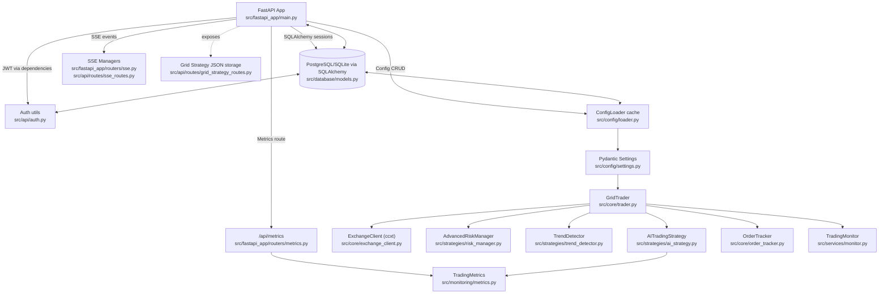

# Grid 项目 - 核心架构分析

## 架构图



## 关键流程说明

### 1. 配置流

**路径**: `/api/configs/*` handler → SQLAlchemy models → `config_loader` 缓存 → `reload_settings()` 更新 `settings` + `TradingConfig`

**关键位置**:
- `src/fastapi_app/routers/config.py:433` - reload 端点
- `src/config/loader.py:46` - ConfigLoader 实现
- `src/config/settings.py:647` - reload_settings 函数

**说明**: 配置变更通过数据库持久化，经过缓存层，最终更新到运行时的Settings对象和TradingConfig

---

### 2. 交易流

**入口**: `main.py:58-210`

**流程**:
1. 创建共享 `ExchangeClient`
2. 初始化 `GlobalFundAllocator`
3. 为每个symbol创建独立的 `GridTrader`
4. 启动 FastAPI 服务器 (`start_fastapi_server`)

**说明**: 主程序负责初始化所有交易相关组件，每个symbol独立运行一个GridTrader实例

---

### 3. 风控/策略依赖

**核心组件**: `GridTrader`

**聚合的策略模块**:
- `AdvancedRiskManager` - 仓位风控
  - 位置: `src/strategies/risk_manager.py`
  - 功能: position guard, 限制仓位比例
  
- `TrendDetector` - 趋势检测
  - 位置: `src/strategies/trend_detector.py`
  - 功能: 限制趋势市场中的交易

- `AITradingStrategy` - AI策略（可选）
  - 位置: `src/strategies/ai_strategy.py`
  - 功能: 提供AI信号建议

- `OrderThrottler` - 订单限流
  - 功能: 防止过度交易

- `OrderTracker` - 订单追踪
  - 位置: `src/core/order_tracker.py`
  - 功能: 跟踪订单状态

**说明**: GridTrader采用组合模式，聚合多个独立的策略和风控组件

---

### 4. 监控系统

**核心组件**: `TradingMetrics`

**位置**: `src/monitoring/metrics.py`

**功能**:
- 暴露 Prometheus 指标
- 被 `AITradingStrategy` 等模块在关键节点调用 `get_metrics()` 更新计数

**暴露端点**:
- `/metrics` - 公开端点，供Prometheus抓取
- `/api/metrics` - 需认证的端点

**指标类型**:
- Counter: 订单计数、错误计数
- Gauge: 余额、仓位
- Histogram: 延迟、性能

---

### 5. 安全认证

**认证方式**: JWT

**实现位置**:
- `src/api/middleware.py` - 中间件
- `src/fastapi_app/dependencies.py` - FastAPI依赖注入

**特殊处理**:
- SSE长连接使用 query token（兼容 EventSource 限制）
- 普通HTTP请求使用 Authorization Header

**用户模型**:
- 位置: `src/database/models.py:162`
- 当前为单管理员模式

---

## 模块职责划分

### 核心交易层 (src/core/)
- `trader.py` - GridTrader主类，协调所有交易逻辑
- `exchange_client.py` - 交易所客户端封装(ccxt)
- `order_tracker.py` - 订单状态追踪

### 策略层 (src/strategies/)
- `risk_manager.py` - 风险管理
- `trend_detector.py` - 趋势检测
- `ai_strategy.py` - AI策略
- `grid_trigger_engine.py` - 网格触发引擎
- `technical_indicators.py` - 技术指标计算

### API层 (src/fastapi_app/, src/api/)
- FastAPI主应用
- 各种路由(auth, config, trades, dashboard等)
- SSE实时通信

### 配置层 (src/config/)
- `settings.py` - Pydantic配置模型
- `loader.py` - 配置加载和缓存
- `config_definitions.py` - 配置定义和验证规则

### 数据层 (src/database/)
- `models.py` - SQLAlchemy模型
- `connection.py` - 数据库连接
- `migrations/` - 数据库迁移脚本

### 监控层 (src/monitoring/)
- `metrics.py` - Prometheus指标

### 服务层 (src/services/)
- `fastapi_server.py` - FastAPI服务器启动
- `monitor.py` - 交易监控
- `alerting.py` - 告警服务

---

## 数据流向

### 配置更新流
```
用户 → API → Database → ConfigLoader缓存 → Settings对象 → GridTrader配置更新
```

### 交易执行流
```
GridTrader主循环 → 策略信号 → 风控检查 → ExchangeClient → 交易所API → OrderTracker记录
```

### 监控数据流
```
交易事件 → TradingMetrics更新 → Prometheus抓取 → Grafana展示
```

### 实时通知流
```
配置变更/交易事件 → SSE Manager → SSE客户端(前端)
```

---

## 设计模式

### 1. 依赖注入 (FastAPI)
- 使用FastAPI的Depends机制进行依赖注入
- 统一的认证依赖: `get_current_user`

### 2. 组合模式 (GridTrader)
- GridTrader聚合多个策略和风控组件
- 每个组件独立可测试

### 3. 工厂模式 (Exchange)
- `src/core/exchanges/factory.py` - 交易所工厂
- 支持多交易所(Binance, OKX)

### 4. 单例模式 (ConfigLoader)
- ConfigLoader使用单例缓存配置
- 避免重复数据库查询

### 5. 观察者模式 (SSE)
- SSE Manager维护订阅者列表
- 事件发生时推送给所有订阅者

---

## 扩展性设计

### 1. 多交易所支持
- 抽象的ExchangeClient接口
- 具体交易所适配器(Binance, OKX)
- 工厂模式创建交易所实例

### 2. 策略可插拔
- GridTrader通过组合方式聚合策略
- 可以轻松添加新策略组件

### 3. 配置热重载
- ConfigLoader支持reload
- GridTrader支持update_config
- 无需重启即可应用新配置

### 4. 监控可扩展
- Prometheus指标系统
- 易于添加新指标

---

## 性能优化

### 1. 配置缓存
- ConfigLoader内存缓存
- 减少数据库查询

### 2. 连接池
- SQLAlchemy连接池
- 复用数据库连接

### 3. 异步处理
- FastAPI异步端点
- 并发处理多个请求

### 4. 批量操作
- 批量配置更新
- 批量导入导出
