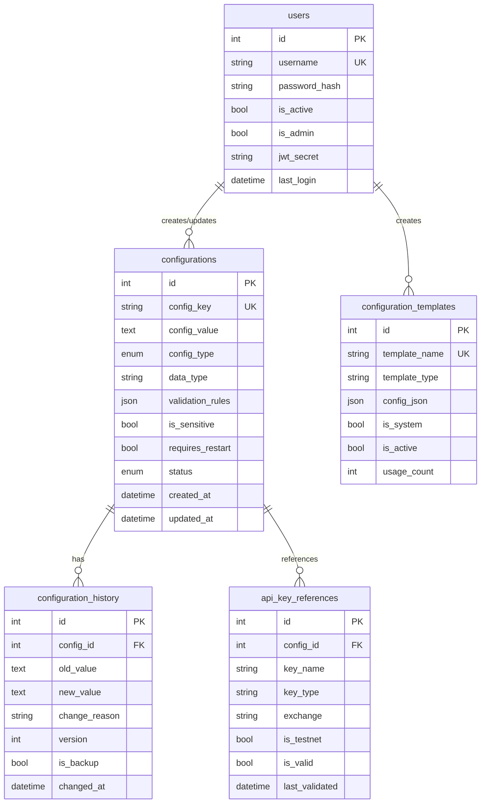

# Grid 项目 - 数据模型分析

## 数据库表结构

### 1. configurations (配置表)

**位置**: `src/database/models.py:37`

**用途**: 存放所有动态配置项，包含UI元数据与验证规则

#### 字段说明

```yaml
主键:
  id: Integer, Primary Key, 自增

核心字段:
  config_key: String(100), Unique, Not Null, Indexed
    说明: 配置项唯一标识
    示例: "BINANCE_API_KEY", "MIN_TRADE_AMOUNT"
  
  config_value: Text, Not Null
    说明: 配置值，支持JSON/标量
    类型: 根据data_type解析
  
  config_type: Enum(ConfigTypeEnum), Not Null, Indexed
    说明: 配置类型分组
    可选值:
      - exchange: 交易所配置
      - trading: 交易参数
      - risk: 风控配置
      - ai: AI策略配置
      - notification: 通知配置
      - system: 系统配置
  
  data_type: String(20), Not Null
    说明: 数据类型
    可选值: string, number, boolean, json

UI元数据:
  display_name: String(200), Not Null
    说明: 用户界面显示名称
  
  description: Text
    说明: 配置项详细说明
  
  category: String(50)
    说明: 前端分类
  
  display_order: Integer, Default=0
    说明: 显示顺序

验证相关:
  validation_rules: JSON
    说明: 验证规则定义
    结构:
      min: 最小值
      max: 最大值
      enum: 枚举值列表
      pattern: 正则表达式
      required: 是否必填

标记位:
  is_required: Boolean, Default=False
    说明: 是否必填项
  
  is_sensitive: Boolean, Default=False
    说明: 是否敏感信息(如密码、密钥)
  
  requires_restart: Boolean, Default=False
    说明: 修改后是否需要重启服务
  
  status: Enum(ConfigStatusEnum), Default='active'
    说明: 配置状态
    可选值:
      - draft: 草稿
      - active: 激活
      - inactive: 停用
      - archived: 归档

审计字段:
  created_at: DateTime, Default=UTC now
  updated_at: DateTime, OnUpdate=UTC now
  created_by: Integer, ForeignKey('users.id')
  updated_by: Integer, ForeignKey('users.id')
```

#### 关系

```yaml
关系映射:
  - One-to-Many → configuration_history
    说明: 配置历史记录
    关联: back_populates='configuration'
    级联: cascade delete
  
  - Referenced by api_key_references
    说明: API密钥引用
  
  - Referenced by configuration_templates
    说明: 配置模板引用(通过config_json字段)
```

#### 索引

```yaml
索引列表:
  - idx_config_key: config_key (Unique)
  - idx_config_type_status: (config_type, status)
    用途: 支撑列表过滤查询
```

---

### 2. configuration_history (配置历史表)

**位置**: `src/database/models.py:76`

**用途**: 记录每次配置变更/备份，支持版本回退

#### 字段说明

```yaml
主键:
  id: Integer, Primary Key

关联字段:
  config_id: Integer, ForeignKey('configurations.id'), CASCADE
    说明: 关联的配置项ID

变更内容:
  old_value: Text
    说明: 变更前的值
  
  new_value: Text
    说明: 变更后的值
  
  change_reason: Text
    说明: 变更原因/说明

版本控制:
  version: Integer, Not Null
    说明: 版本号，手动递增
  
  is_backup: Boolean, Default=False
    说明: 是否为备份记录
  
  backup_type: String(50)
    说明: 备份类型
    可选值:
      - manual: 手动备份
      - auto: 自动备份
      - import: 导入备份

审计信息:
  changed_at: DateTime, Default=UTC now, Indexed
  changed_by: Integer, ForeignKey('users.id')
```

#### 关系

```yaml
关系映射:
  - Many-to-One → configurations
    说明: 属于某个配置项
    关联: back_populates='history'
```

#### 索引

```yaml
索引列表:
  - idx_history_config_time: (config_id, changed_at DESC)
    用途: 加速查询最新历史记录
```

---

### 3. api_key_references (API密钥引用表)

**位置**: `src/database/models.py:106`

**用途**: 跟踪配置引用的交易所API密钥，便于验证/轮换

#### 字段说明

```yaml
主键:
  id: Integer, Primary Key

关联字段:
  config_id: Integer, ForeignKey('configurations.id')
    说明: 引用的配置项ID

密钥标识:
  key_name: String(100), Not Null
    说明: 密钥名称
  
  key_type: String(50), Not Null
    说明: 密钥类型
    可选值:
      - api_key: API Key
      - secret_key: Secret Key
      - passphrase: API密码短语
  
  exchange: String(50), Not Null
    说明: 交易所名称
    示例: binance, okx

环境标记:
  is_testnet: Boolean, Default=False
    说明: 是否为测试网密钥

健康状态:
  is_valid: Boolean, Default=True
    说明: 密钥是否有效
  
  last_validated: DateTime
    说明: 最后验证时间
  
  validation_error: Text
    说明: 验证错误信息

审计字段:
  created_at: DateTime, Default=UTC now
  updated_at: DateTime, OnUpdate=UTC now
```

#### 使用场景

- API密钥健康检查
- 密钥轮换管理
- 测试网/生产网隔离
- 密钥权限验证

---

### 4. configuration_templates (配置模板表)

**位置**: `src/database/models.py:133`

**用途**: 保存配置模板集，供快速应用

#### 字段说明

```yaml
主键:
  id: Integer, Primary Key

模板标识:
  template_name: String(100), Unique, Not Null
    说明: 模板唯一名称
    示例: conservative, aggressive
  
  template_type: String(50), Not Null
    说明: 模板类型
    示例: grid_strategy, risk_profile

UI信息:
  display_name: String(200), Not Null
    说明: 显示名称
  
  description: Text
    说明: 模板说明

模板内容:
  config_json: JSON, Not Null
    说明: 配置项键值对
    结构:
      key1: value1
      key2: value2
      ...

标记位:
  is_system: Boolean, Default=False
    说明: 是否为系统内置模板
  
  is_active: Boolean, Default=True
    说明: 是否激活

使用统计:
  usage_count: Integer, Default=0
    说明: 使用次数累计

审计字段:
  created_at: DateTime, Default=UTC now
  updated_at: DateTime, OnUpdate=UTC now
  created_by: Integer, ForeignKey('users.id')
```

#### 使用场景

- 快速应用预设配置
- 配置批量切换
- 最佳实践模板
- 用户自定义模板

---

### 5. users (用户表)

**位置**: `src/database/models.py:162`

**用途**: JWT认证用户管理（当前为单管理员模式）

#### 字段说明

```yaml
主键:
  id: Integer, Primary Key

认证信息:
  username: String(50), Unique, Not Null
    说明: 用户名
  
  password_hash: String(255), Not Null
    说明: bcrypt密码哈希

权限标记:
  is_active: Boolean, Default=True
    说明: 账户是否激活
  
  is_admin: Boolean, Default=False
    说明: 是否为管理员

Token管理:
  jwt_secret: String(255)
    说明: 用户专属JWT密钥
    用途: 用于Token失效控制

用户资料:
  email: String(100), Unique
  full_name: String(100)

登录统计:
  last_login: DateTime
    说明: 最后登录时间
  
  login_count: Integer, Default=0
    说明: 登录次数

审计字段:
  created_at: DateTime, Default=UTC now
  updated_at: DateTime, OnUpdate=UTC now
```

#### 使用场景

- JWT Token生成和验证
- 配置变更审计
- 用户权限控制
- 登录历史追踪

---

## 枚举类型

### ConfigTypeEnum

```yaml
枚举值:
  exchange: 交易所配置
    示例: EXCHANGE, API_KEY, SECRET_KEY
  
  trading: 交易参数
    示例: SYMBOLS, MIN_TRADE_AMOUNT, GRID_SIZE
  
  risk: 风控配置
    示例: POSITION_LIMITS, STOP_LOSS_PERCENTAGE
  
  ai: AI策略配置
    示例: AI_ENABLED, AI_CONFIDENCE_THRESHOLD
  
  notification: 通知配置
    示例: TELEGRAM_TOKEN, PUSHPLUS_TOKEN
  
  system: 系统配置
    示例: LOG_LEVEL, DATABASE_URL
```

### ConfigStatusEnum

```yaml
枚举值:
  draft: 草稿状态
    说明: 配置正在编辑中，未生效
  
  active: 激活状态
    说明: 配置已生效，正在使用
  
  inactive: 停用状态
    说明: 配置暂时停用
  
  archived: 归档状态
    说明: 配置已废弃，保留记录
```

---

## 表间关系图



---

## 数据访问模式

### 1. 配置读取模式

**高频访问**:
```python
# ConfigLoader缓存模式
config_loader.get('MIN_TRADE_AMOUNT')  # 从内存缓存读取
```

**数据库查询**:
```sql
-- 获取激活的配置
SELECT * FROM configurations 
WHERE status = 'active'
```

### 2. 配置更新模式

**单项更新**:
```python
# 1. 更新配置
config.config_value = new_value
config.updated_at = datetime.now()

# 2. 写入历史
history = ConfigHistory(
    config_id=config.id,
    old_value=old_value,
    new_value=new_value,
    version=config.version + 1
)
```

**批量更新**:
```python
# 事务处理
with session.begin():
    for update in updates:
        config = session.query(Configuration).get(update.id)
        # 更新逻辑...
```

### 3. 历史查询模式

**版本回溯**:
```sql
-- 获取配置的历史版本
SELECT * FROM configuration_history
WHERE config_id = ?
ORDER BY changed_at DESC
LIMIT 10
```

**审计查询**:
```sql
-- 查询特定用户的变更
SELECT h.*, c.config_key
FROM configuration_history h
JOIN configurations c ON h.config_id = c.id
WHERE h.changed_by = ?
ORDER BY h.changed_at DESC
```

---

## 数据一致性保证

### 1. 外键约束

- `configuration_history.config_id` → `configurations.id` (CASCADE DELETE)
- `configurations.created_by/updated_by` → `users.id`
- `api_key_references.config_id` → `configurations.id`

### 2. 唯一性约束

- `configurations.config_key` - 防止重复配置项
- `users.username` - 防止重复用户名
- `configuration_templates.template_name` - 防止重复模板名

### 3. 索引优化

- 复合索引 `(config_type, status)` - 支持列表查询
- 时间索引 `(changed_at)` - 支持历史查询
- 外键索引 - 加速关联查询

---

## 数据迁移策略

### 初始化迁移

**位置**: `src/database/migrations/001_initial_schema.py`

**操作**:
1. 创建所有表结构
2. 添加索引和约束
3. 插入默认数据(管理员用户、系统配置)

### 配置导入导出

**导出格式**:
```json
{
  "version": "1.0",
  "exported_at": "2025-12-14T00:00:00Z",
  "configs": [
    {
      "config_key": "MIN_TRADE_AMOUNT",
      "config_value": "20",
      "config_type": "trading",
      "data_type": "number"
    }
  ]
}
```

**导入策略**:
- 支持覆盖/跳过已存在项
- 创建备份点
- 验证数据完整性

---

## 性能考虑

### 1. 查询优化

- 使用索引加速常用查询
- 避免全表扫描
- 使用分页限制结果集

### 2. 缓存策略

- ConfigLoader内存缓存
- 减少数据库访问
- 定期刷新保证一致性

### 3. 批量操作

- 批量更新使用事务
- 减少数据库往返
- 提高吞吐量

---

## 数据安全

### 1. 敏感信息处理

- `is_sensitive` 标记敏感配置
- API响应过滤敏感字段
- 日志脱敏

### 2. 审计追踪

- 完整的变更历史
- 用户操作记录
- 时间戳审计

### 3. 访问控制

- JWT认证
- 用户权限检查
- API密钥管理
