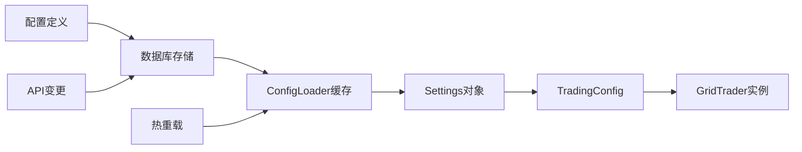
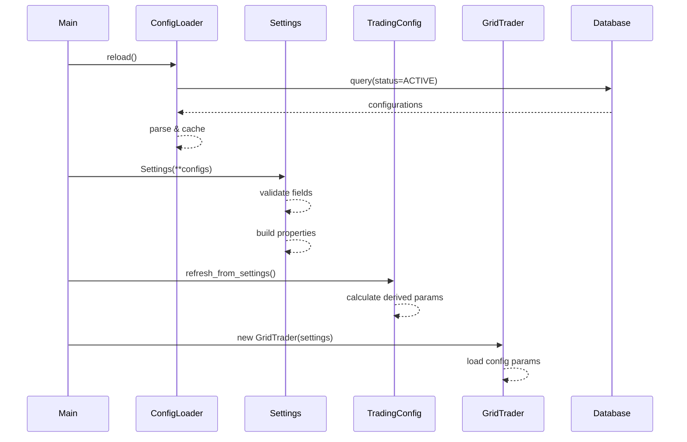
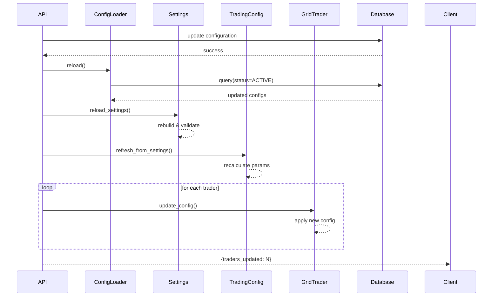

# Grid 项目 - 配置系统设计分析

## 系统概述

Grid项目的配置系统采用**多层架构设计**，实现了配置的定义、存储、验证、缓存和热重载的完整生命周期管理。



---

## 核心组件

### 1. 配置定义层 (Config Definitions)

**位置**: `src/config/config_definitions.py:1-982`

**核心数据结构**: `ConfigDefinition`

```yaml
ConfigDefinition:
  # 基本信息
  config_key: str          # 唯一标识符
  config_type: ConfigTypeEnum  # 类型分组
  data_type: str           # 数据类型
  default_value: Any       # 默认值
  
  # UI元数据
  display_name: str        # 显示名称
  description: str         # 详细说明
  category: str            # 前端分类
  display_order: int       # 显示顺序
  
  # 验证规则
  validation_rules: dict
    min: float             # 最小值
    max: float             # 最大值
    enum: List[str]        # 枚举值
    pattern: str           # 正则表达式
    required: bool         # 是否必填
  
  # 标记位
  is_required: bool        # 是否必填
  is_sensitive: bool       # 是否敏感
  requires_restart: bool   # 是否需要重启
```

**典型配置示例**:

```python
ALL_CONFIGS = {
    "EXCHANGE": ConfigDefinition(
        config_key="EXCHANGE",
        config_type=ConfigTypeEnum.EXCHANGE,
        data_type="string",
        default_value="binance",
        display_name="交易所选择",
        description="选择使用的交易所",
        validation_rules={
            "enum": ["binance", "okx"],
            "required": True
        },
        is_required=True,
        requires_restart=True
    ),
    
    "MIN_TRADE_AMOUNT": ConfigDefinition(
        config_key="MIN_TRADE_AMOUNT",
        config_type=ConfigTypeEnum.TRADING,
        data_type="number",
        default_value=20,
        display_name="最小交易金额",
        description="单次交易的最小金额(USDT)",
        validation_rules={
            "min": 10,
            "max": 10000,
            "required": True
        },
        is_required=True,
        requires_restart=False
    ),
    
    "GRID_PARAMS_JSON": ConfigDefinition(
        config_key="GRID_PARAMS_JSON",
        config_type=ConfigTypeEnum.TRADING,
        data_type="json",
        default_value="{}",
        display_name="网格参数配置",
        description="各交易对的网格参数",
        validation_rules={},
        is_required=False,
        requires_restart=False
    )
}
```

**使用场景**:
1. **数据库初始化**: Seeder根据定义创建Configuration记录
2. **前端表单生成**: 动态渲染配置界面
3. **配置验证**: 导入时验证数据合法性
4. **API文档**: 生成配置说明文档

---

### 2. 配置加载层 (ConfigLoader)

**位置**: `src/config/loader.py:31-150`

**核心类**: `ConfigLoader`

#### 主要方法

**reload() - 重载配置**
```python
def reload(self) -> int:
    """
    从数据库重新加载所有激活的配置到内存缓存
    
    Returns:
        int: 成功加载的配置项数量
    """
    with get_db() as db:
        # 查询激活的配置
        configs = db.query(Configuration)\
                   .filter(Configuration.status == ConfigStatusEnum.ACTIVE)\
                   .all()
        
        new_cache = {}
        sensitive_keys = set()
        
        for config in configs:
            # 解析数据类型
            value = self._parse_value(
                config.config_value, 
                config.data_type
            )
            new_cache[config.config_key] = value
            
            if config.is_sensitive:
                sensitive_keys.add(config.config_key)
        
        # 原子替换缓存
        self._cache = new_cache
        self._sensitive_keys = sensitive_keys
        
        return len(new_cache)
```

**get() - 获取配置值**
```python
def get(self, key: str, fallback: Any = None) -> Any:
    """
    获取配置值，支持多层优先级
    
    优先级:
        1. 数据库缓存
        2. 环境变量
        3. 配置定义默认值
        4. fallback参数
    
    Args:
        key: 配置键
        fallback: 默认值
    
    Returns:
        配置值
    """
    # 1. 从缓存读取
    if key in self._cache:
        return self._cache[key]
    
    # 2. 从环境变量读取
    env_value = os.getenv(key)
    if env_value is not None:
        return self._parse_env_value(env_value, key)
    
    # 3. 从定义读取默认值
    if key in ALL_CONFIGS:
        return ALL_CONFIGS[key].default_value
    
    # 4. 返回fallback
    return fallback
```

**get_all() - 获取所有配置**
```python
def get_all(self, include_sensitive: bool = False) -> Dict[str, Any]:
    """
    获取所有配置项
    
    Args:
        include_sensitive: 是否包含敏感信息
    
    Returns:
        配置字典
    """
    if include_sensitive:
        return self._cache.copy()
    
    # 过滤敏感配置
    return {
        k: v for k, v in self._cache.items()
        if k not in self._sensitive_keys
    }
```

#### 数据类型解析

```python
def _parse_value(self, value: str, data_type: str) -> Any:
    """解析配置值"""
    if data_type == "boolean":
        return value.lower() in ("true", "1", "yes")
    elif data_type == "number":
        return float(value) if '.' in value else int(value)
    elif data_type == "json":
        return json.loads(value)
    else:  # string
        return value
```

#### 缓存特性

1. **线程安全**: 使用原子操作替换缓存
2. **内存高效**: 只缓存激活的配置
3. **敏感信息隔离**: 分离存储敏感配置键

---

### 3. 配置模型层 (Settings)

**位置**: `src/config/settings.py:1-646`

**核心类**: `Settings` (Pydantic模型)

#### 字段分类

**交易所配置**:
```python
EXCHANGE: str = "binance"
TESTNET_MODE: bool = False
BINANCE_API_KEY: str = ""
BINANCE_SECRET_KEY: str = ""
OKX_API_KEY: str = ""
OKX_SECRET_KEY: str = ""
OKX_PASSPHRASE: str = ""
```

**交易参数**:
```python
SYMBOLS: str = "BNB/USDT"
MIN_TRADE_AMOUNT: float = 20.0
INITIAL_GRID: float = 2.0
GRID_PARAMS_JSON: str = "{}"
DYNAMIC_INTERVAL_PARAMS: str = "{}"
```

**风控配置**:
```python
GLOBAL_MAX_USAGE: float = 0.95
POSITION_LIMITS_JSON: str = "{}"
STOP_LOSS_PERCENTAGE: float = 10.0
TAKE_PROFIT_DRAWDOWN: float = 50.0
```

**AI配置**:
```python
AI_ENABLED: bool = False
AI_CONFIDENCE_THRESHOLD: float = 70.0
AI_MAX_CALLS_PER_DAY: int = 100
AI_TRIGGER_INTERVAL: int = 300
```

#### 验证器示例

**API密钥验证**:
```python
@validator('BINANCE_API_KEY')
def validate_binance_api_key(cls, v, values):
    """验证Binance API密钥"""
    exchange = values.get('EXCHANGE')
    testnet = values.get('TESTNET_MODE')
    
    # 正式环境必须提供密钥
    if exchange == 'binance' and not testnet:
        if not v or len(v) < 64:
            raise ValueError(
                "Binance API key must be at least 64 characters"
            )
    
    return v
```

**交易金额验证**:
```python
@validator('MIN_TRADE_AMOUNT')
def validate_min_trade_amount(cls, v):
    """验证最小交易金额"""
    if v < 10:
        raise ValueError("MIN_TRADE_AMOUNT must be >= 10")
    if v > 10000:
        raise ValueError("MIN_TRADE_AMOUNT must be <= 10000")
    
    return v
```

**Symbol格式验证**:
```python
@validator('SYMBOLS')
def validate_symbols(cls, v):
    """验证交易对格式"""
    symbols = [s.strip() for s in v.split(',')]
    
    for symbol in symbols:
        if '/' not in symbol:
            raise ValueError(
                f"Invalid symbol format: {symbol}. "
                f"Expected format: BASE/QUOTE"
            )
    
    return v
```

**AI配置验证**:
```python
@validator('AI_CONFIDENCE_THRESHOLD')
def validate_ai_confidence(cls, v):
    """验证AI置信度阈值"""
    if not 0 <= v <= 100:
        raise ValueError(
            "AI_CONFIDENCE_THRESHOLD must be between 0 and 100"
        )
    
    if v < 50:
        logger.warning(
            "Low confidence threshold may result in "
            "frequent AI trades"
        )
    
    return v
```

#### 派生属性

```python
@property
def SYMBOLS_LIST(self) -> List[str]:
    """解析交易对列表"""
    return [s.strip() for s in self.SYMBOLS.split(',')]

@property
def FLIP_THRESHOLD(self) -> float:
    """计算翻转阈值"""
    return self.INITIAL_GRID * 0.5

@property
def POSITION_LIMITS(self) -> Dict[str, Dict[str, float]]:
    """解析仓位限制"""
    if not self.POSITION_LIMITS_JSON:
        return {}
    return json.loads(self.POSITION_LIMITS_JSON)
```

---

### 4. 交易配置层 (TradingConfig)

**位置**: `src/config/settings.py:551-646`

**用途**: 根据Settings生成派生交易参数

#### 核心方法

**refresh_from_settings() - 刷新配置**
```python
@classmethod
def refresh_from_settings(cls):
    """从Settings刷新所有派生参数"""
    cls.GRID_RANGES = cls._calculate_grid_ranges()
    cls.DYNAMIC_INTERVALS = cls._parse_dynamic_intervals()
    cls.RISK_PARAMS = cls._build_risk_params()
    cls.VOLUME_WEIGHTS = cls._calculate_volume_weights()
```

**_calculate_grid_ranges() - 计算网格范围**
```python
@classmethod
def _calculate_grid_ranges(cls) -> Dict[str, Tuple[float, float]]:
    """
    根据GRID_PARAMS_JSON计算每个交易对的网格范围
    
    Returns:
        {symbol: (min_price, max_price)}
    """
    grid_params = json.loads(settings.GRID_PARAMS_JSON)
    ranges = {}
    
    for symbol, params in grid_params.items():
        base_price = params.get('base_price')
        grid_size = params.get('grid_size', settings.INITIAL_GRID)
        num_grids = params.get('num_grids', 10)
        
        min_price = base_price - (grid_size * num_grids / 2)
        max_price = base_price + (grid_size * num_grids / 2)
        
        ranges[symbol] = (min_price, max_price)
    
    return ranges
```

**_parse_dynamic_intervals() - 解析动态间隔**
```python
@classmethod
def _parse_dynamic_intervals(cls) -> Dict[str, Any]:
    """
    解析DYNAMIC_INTERVAL_PARAMS
    
    Returns:
        {
            'volatility_thresholds': [0.5, 1.0, 2.0],
            'grid_size_multipliers': [0.8, 1.0, 1.2],
            'check_interval': 60
        }
    """
    if not settings.DYNAMIC_INTERVAL_PARAMS:
        return cls._get_default_intervals()
    
    return json.loads(settings.DYNAMIC_INTERVAL_PARAMS)
```

**_build_risk_params() - 构建风控参数**
```python
@classmethod
def _build_risk_params(cls) -> Dict[str, Any]:
    """
    构建风控参数集
    
    Returns:
        {
            'global_max_usage': 0.95,
            'per_symbol_limits': {...},
            'stop_loss_pct': 10.0,
            'take_profit_pct': 50.0
        }
    """
    return {
        'global_max_usage': settings.GLOBAL_MAX_USAGE,
        'per_symbol_limits': settings.POSITION_LIMITS,
        'stop_loss_pct': settings.STOP_LOSS_PERCENTAGE,
        'take_profit_pct': settings.TAKE_PROFIT_DRAWDOWN
    }
```

---

### 5. 热重载机制

**位置**: `src/config/settings.py:647-676`

**函数**: `reload_settings()`

#### 重载流程

```python
def reload_settings() -> Settings:
    """
    热重载配置的完整流程
    
    步骤:
        1. ConfigLoader重载数据库缓存
        2. 重建Settings对象
        3. 同步派生属性
        4. 刷新TradingConfig
        5. 通知所有Trader更新
    
    Returns:
        新的Settings对象
    """
    global settings
    
    # Step 1: 重载ConfigLoader缓存
    config_count = config_loader.reload()
    logger.info(f"Reloaded {config_count} configs from database")
    
    # Step 2: 重建Settings对象
    settings = Settings(
        **config_loader.get_all(include_sensitive=True)
    )
    logger.info("Settings object rebuilt")
    
    # Step 3: 同步派生属性
    # (Pydantic会自动执行@property方法)
    
    # Step 4: 刷新TradingConfig
    TradingConfig.refresh_from_settings()
    logger.info("TradingConfig refreshed")
    
    return settings
```

#### API触发重载

**位置**: `src/fastapi_app/routers/config.py:433-470`

```python
@router.post("/reload")
async def reload_configs(
    current_user: User = Depends(get_current_user)
):
    """
    API端点：触发配置热重载
    
    操作:
        1. 调用reload_settings()
        2. 更新所有GridTrader实例
        3. 返回更新统计
    """
    try:
        # 重载配置
        new_settings = reload_settings()
        
        # 更新所有Trader
        traders_updated = 0
        for trader in app.state.traders:
            try:
                trader.update_config()
                traders_updated += 1
            except Exception as e:
                logger.error(
                    f"Failed to update trader {trader.symbol}: {e}"
                )
        
        return {
            "message": "Configuration reloaded successfully",
            "cache_size": len(config_loader._cache),
            "traders_updated": traders_updated,
            "warnings": []
        }
        
    except Exception as e:
        logger.error(f"Config reload failed: {e}")
        raise HTTPException(
            status_code=500,
            detail=f"Reload failed: {str(e)}"
        )
```

#### Trader配置更新

**位置**: `src/core/trader.py:401`

```python
def update_config(self):
    """
    更新Trader的运行时配置
    
    操作:
        1. 更新网格参数
        2. 更新风控限制
        3. 更新AI配置
        4. 持久化状态
    """
    logger.info(f"Updating config for {self.symbol}")
    
    # 1. 更新网格参数
    grid_params = TradingConfig.GRID_RANGES.get(self.symbol)
    if grid_params:
        self.min_price, self.max_price = grid_params
        self.grid_size = settings.get_grid_size(self.symbol)
        logger.info(f"Grid updated: size={self.grid_size}")
    
    # 2. 更新风控限制
    risk_params = TradingConfig.RISK_PARAMS
    self.risk_manager.update_limits(
        global_max=risk_params['global_max_usage'],
        symbol_limits=risk_params.get('per_symbol_limits', {})
    )
    logger.info("Risk limits updated")
    
    # 3. 更新AI配置（如果启用）
    if self.ai_strategy and settings.AI_ENABLED:
        self.ai_strategy.update_config({
            'confidence_threshold': settings.AI_CONFIDENCE_THRESHOLD,
            'max_calls_per_day': settings.AI_MAX_CALLS_PER_DAY,
            'trigger_interval': settings.AI_TRIGGER_INTERVAL
        })
        logger.info("AI config updated")
    
    # 4. 持久化状态
    self._save_state()
    logger.info("State saved")
```

---

## 配置生命周期

### 1. 初始化阶段



### 2. 运行时更新



---

## 配置验证体系

### 1. 层次化验证

```yaml
验证层次:
  Layer 1 - 定义层:
    - config_definitions.py中的validation_rules
    - 静态规则定义
  
  Layer 2 - 数据库层:
    - SQLAlchemy模型约束
    - 外键、唯一性、非空检查
  
  Layer 3 - 加载层:
    - ConfigLoader的类型解析
    - JSON格式验证
  
  Layer 4 - 模型层:
    - Pydantic验证器
    - 字段级验证逻辑
    - 跨字段验证
  
  Layer 5 - 业务层:
    - TradingConfig的派生计算
    - 业务规则验证
```

### 2. 验证规则示例

**数值范围**:
```python
validation_rules = {
    "min": 10,
    "max": 10000
}

@validator('MIN_TRADE_AMOUNT')
def validate_range(cls, v):
    assert 10 <= v <= 10000
    return v
```

**枚举值**:
```python
validation_rules = {
    "enum": ["binance", "okx"]
}

@validator('EXCHANGE')
def validate_enum(cls, v):
    assert v in ["binance", "okx"]
    return v
```

**格式模式**:
```python
validation_rules = {
    "pattern": r"^[A-Z]+/[A-Z]+$"
}

@validator('SYMBOLS')
def validate_pattern(cls, v):
    import re
    for symbol in v.split(','):
        assert re.match(r'^[A-Z]+/[A-Z]+$', symbol.strip())
    return v
```

**依赖验证**:
```python
@validator('BINANCE_SECRET_KEY')
def validate_secret(cls, v, values):
    # 只有选择binance时才验证密钥
    if values.get('EXCHANGE') == 'binance':
        assert len(v) >= 64
    return v
```

---

## 默认值体系

### 交易所默认值
```yaml
EXCHANGE: "binance"
TESTNET_MODE: false
```

### 交易参数默认值
```yaml
SYMBOLS: "BNB/USDT"
MIN_TRADE_AMOUNT: 20
INITIAL_GRID: 2.0
GRID_PARAMS_JSON: "{}"
DYNAMIC_INTERVAL_PARAMS: "{}"
```

### 风控默认值
```yaml
GLOBAL_MAX_USAGE: 0.95  # 95%全局资金使用率
POSITION_LIMITS_JSON: "{}"
STOP_LOSS_PERCENTAGE: 10.0
TAKE_PROFIT_DRAWDOWN: 50.0
```

### AI默认值
```yaml
AI_ENABLED: false
AI_CONFIDENCE_THRESHOLD: 70.0  # 70%置信度
AI_MAX_CALLS_PER_DAY: 100
AI_TRIGGER_INTERVAL: 300  # 5分钟
```

### 趋势检测默认值
```yaml
ENABLE_TREND_DETECTION: true
TREND_EMA_SHORT: 20
TREND_EMA_LONG: 50
TREND_ADX_PERIOD: 14
TREND_STRONG_THRESHOLD: 60  # 强趋势阈值
```

---

## 配置集成点

### 1. API层集成

**config-definitions端点**:
```python
@router.get("/config-definitions")
async def get_config_definitions():
    """暴露配置定义供前端动态渲染"""
    return {
        key: {
            "display_name": defin.display_name,
            "description": defin.description,
            "data_type": defin.data_type,
            "default_value": defin.default_value,
            "validation_rules": defin.validation_rules
        }
        for key, defin in ALL_CONFIGS.items()
    }
```

### 2. Trader层集成

**GridTrader初始化**:
```python
class GridTrader:
    def __init__(self, symbol: str, ...):
        # 从settings读取配置
        self.symbol = symbol
        self.min_trade_amount = settings.MIN_TRADE_AMOUNT
        self.grid_size = settings.get_grid_size(symbol)
        
        # 从TradingConfig读取派生参数
        self.grid_range = TradingConfig.GRID_RANGES[symbol]
        self.risk_params = TradingConfig.RISK_PARAMS
```

### 3. 策略层集成

**AI策略配置**:
```python
class AITradingStrategy:
    def __init__(self):
        self.enabled = settings.AI_ENABLED
        self.confidence_threshold = settings.AI_CONFIDENCE_THRESHOLD
        self.max_daily_calls = settings.AI_MAX_CALLS_PER_DAY
        self.trigger_interval = settings.AI_TRIGGER_INTERVAL
```

### 4. 风控层集成

**风险管理器配置**:
```python
class AdvancedRiskManager:
    def __init__(self):
        self.global_max_usage = settings.GLOBAL_MAX_USAGE
        self.position_limits = settings.POSITION_LIMITS
        self.stop_loss_pct = settings.STOP_LOSS_PERCENTAGE
```

---

## 最佳实践

### 1. 配置命名规范

- 使用大写字母和下划线
- 前缀表示类别（如`AI_`, `TREND_`）
- 后缀表示类型（如`_JSON`, `_PERCENTAGE`）

### 2. 敏感信息处理

- 标记`is_sensitive=True`
- API响应自动过滤
- 日志记录脱敏

### 3. 热重载安全

- 使用原子操作更新缓存
- 验证配置完整性后再应用
- 失败时回滚到旧配置

### 4. 性能优化

- 缓存频繁访问的配置
- 批量更新减少数据库往返
- 异步重载避免阻塞

---

## 总结

Grid项目的配置系统特点：

1. **分层设计** - 定义、存储、缓存、模型、应用五层架构
2. **类型安全** - Pydantic强类型验证
3. **热重载** - 支持运行时配置更新
4. **可扩展** - 易于添加新配置项
5. **可审计** - 完整的变更历史
6. **高性能** - 多级缓存机制
