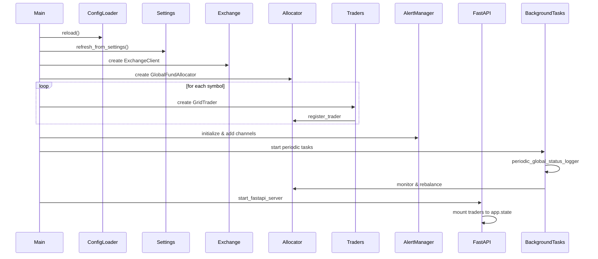
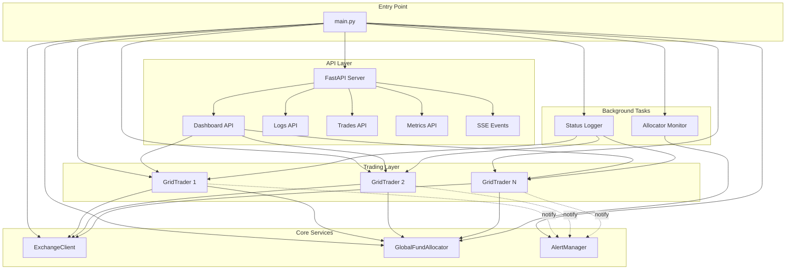

# Grid 项目 - 补充组件分析

> 本文档基于代码review反馈，补充之前遗漏的重要系统组件分析

---

## 1. GlobalFundAllocator (全局资金分配器)

**位置**: `src/strategies/global_allocator.py`

**优先级**: 高 - 这是多币种并发交易的核心协调组件

### 核心职责

GlobalFundAllocator负责在多个交易对(symbol)之间协调和分配有限的交易资金，防止资金竞争和过度使用。

### 类结构

```yaml
AllocationStrategy:
  说明: 分配策略枚举
  可能值:
    - EQUAL: 平均分配
    - WEIGHTED: 加权分配
    - DYNAMIC: 动态分配

TraderAllocation:
  说明: 单个trader的资金分配记录
  字段:
    symbol: str
    allocated_amount: float
    used_amount: float
    max_usage_pct: float

GlobalFundAllocator:
  说明: 全局资金分配器主类
  核心方法:
    - __init__: 初始化分配器
    - _initialize_allocations: 初始化各trader的资金分配
    - register_trader: 注册新的trader
    - check_trade_allowed: 检查交易是否被允许
    - record_trade: 记录交易并更新使用量
    - _get_global_usage: 获取全局资金使用率
    - rebalance_if_needed: 需要时重新平衡资金
    - get_allocation_status: 获取分配状态
    - get_global_status_summary: 获取全局状态摘要
```

### 关键流程

#### 1.1 初始化流程

**位置**: `src/main.py:138-210`

```python
# 伪代码
# Step 1: 创建全局分配器
allocator = GlobalFundAllocator(
    exchange_client=exchange_client,
    total_funds=settings.TOTAL_FUNDS,
    global_max_usage=settings.GLOBAL_MAX_USAGE,
    strategy=AllocationStrategy.DYNAMIC
)

# Step 2: 为每个交易对创建trader并注册
for symbol in settings.SYMBOLS_LIST:
    trader = GridTrader(
        symbol=symbol,
        exchange_client=exchange_client,
        allocator=allocator,
        ...
    )
    
    # 注册到分配器
    allocator.register_trader(
        symbol=symbol,
        max_usage_pct=settings.get_symbol_limit(symbol)
    )
    
    traders.append(trader)
```

#### 1.2 交易前检查流程

**调用链**: GridTrader.execute_order → GlobalFundAllocator.check_trade_allowed

```python
# 伪代码
def execute_order(self, side, amount):
    # Step 1: 请求资金分配器检查
    is_allowed, reason = self.allocator.check_trade_allowed(
        symbol=self.symbol,
        side=side,
        amount=amount
    )
    
    if not is_allowed:
        logger.warning(f"Trade blocked: {reason}")
        return False
    
    # Step 2: 执行交易
    order = self.exchange_client.create_order(...)
    
    # Step 3: 记录到分配器
    self.allocator.record_trade(
        symbol=self.symbol,
        side=side,
        amount=amount
    )
    
    return True
```

#### 1.3 资金重平衡流程

**触发条件**:
- 定期检查 (例如每小时)
- 某个trader的资金使用率过低/过高
- 全局资金使用率不均衡

```python
# 伪代码
async def rebalance_if_needed(self):
    # Step 1: 计算各trader的使用率
    usages = {
        symbol: alloc.used_amount / alloc.allocated_amount
        for symbol, alloc in self.allocations.items()
    }
    
    # Step 2: 判断是否需要重平衡
    max_usage = max(usages.values())
    min_usage = min(usages.values())
    
    if max_usage - min_usage > 0.3:  # 差异超过30%
        # Step 3: 重新计算分配
        self._initialize_allocations()
        
        # Step 4: 通知各trader更新
        for trader in self.traders:
            trader.on_allocation_updated()
```

### 并发安全机制

```python
class GlobalFundAllocator:
    def __init__(self):
        # 使用asyncio.Lock保证线程安全
        self._lock = asyncio.Lock()
        self.allocations = {}
    
    async def check_trade_allowed(self, symbol, side, amount):
        async with self._lock:
            # 原子性检查和更新
            current_usage = self._get_global_usage()
            
            if current_usage + amount > self.max_allowed:
                return False, "Global limit exceeded"
            
            # 检查单个symbol限制
            alloc = self.allocations[symbol]
            if alloc.used_amount + amount > alloc.allocated_amount:
                return False, f"{symbol} limit exceeded"
            
            return True, "OK"
```

### 监控指标

GlobalFundAllocator应该暴露以下监控指标：

```yaml
指标:
  - global_fund_usage_pct: 全局资金使用百分比
  - per_symbol_usage_pct: 每个交易对的资金使用百分比
  - rebalance_count: 重平衡次数
  - blocked_trades_count: 因资金限制被阻止的交易数
  - allocation_efficiency: 资金分配效率
```

---

## 2. AlertManager (告警管理器)

**位置**: `src/services/alerting.py`

**优先级**: 中 - 负责系统异常和重要事件的通知

### 类结构

```yaml
AlertLevel:
  说明: 告警级别枚举
  级别:
    - INFO: 信息性通知
    - WARNING: 警告
    - ERROR: 错误
    - CRITICAL: 严重错误

AlertChannel:
  说明: 告警通道接口
  实现:
    - PushPlusChannel: PushPlus推送
    - TelegramChannel: Telegram通知
    - EmailChannel: 邮件通知

AlertManager:
  说明: 告警管理器主类
  字段:
    - channels: Dict[str, AlertChannel]
    - _enabled: bool
  
  核心方法:
    - __init__: 初始化管理器
    - add_channel: 添加告警通道
    - remove_channel: 移除告警通道
    - enable: 启用告警
    - disable: 禁用告警
    - send_alert: 发送告警
```

### 初始化流程

**位置**: `src/main.py:113-137`

```python
# 伪代码
# Step 1: 创建AlertManager
alert_manager = AlertManager()

# Step 2: 添加通道
if settings.PUSHPLUS_TOKEN:
    alert_manager.add_channel(
        "pushplus",
        PushPlusChannel(token=settings.PUSHPLUS_TOKEN)
    )

if settings.TELEGRAM_TOKEN:
    alert_manager.add_channel(
        "telegram",
        TelegramChannel(
            token=settings.TELEGRAM_TOKEN,
            chat_id=settings.TELEGRAM_CHAT_ID
        )
    )

# Step 3: 启用告警
alert_manager.enable()
```

### 告警发送流程

```python
# 伪代码
async def send_alert(
    self,
    level: AlertLevel,
    title: str,
    message: str,
    channels: Optional[List[str]] = None,
    context: Optional[Dict] = None
):
    """
    发送告警
    
    Args:
        level: 告警级别
        title: 标题
        message: 消息内容
        channels: 指定通道（None表示所有通道）
        context: 上下文信息（如交易对、金额等）
    """
    if not self._enabled:
        return
    
    # Step 1: 确定发送通道
    target_channels = channels or list(self.channels.keys())
    
    # Step 2: 构造消息
    full_message = f"[{level.name}] {title}\n\n{message}"
    
    if context:
        full_message += f"\n\n上下文: {json.dumps(context, indent=2)}"
    
    # Step 3: 并发发送到所有通道
    tasks = []
    for channel_name in target_channels:
        channel = self.channels.get(channel_name)
        if channel:
            task = channel.send(full_message)
            tasks.append(task)
    
    # Step 4: 等待所有发送完成
    results = await asyncio.gather(*tasks, return_exceptions=True)
    
    # Step 5: 记录失败的通道
    for i, result in enumerate(results):
        if isinstance(result, Exception):
            logger.error(
                f"Alert failed on {target_channels[i]}: {result}"
            )
```

### 典型使用场景

#### 2.1 交易异常告警

```python
# GridTrader中
try:
    order = await self.exchange_client.create_order(...)
except Exception as e:
    await alert_manager.send_alert(
        level=AlertLevel.ERROR,
        title="交易执行失败",
        message=f"交易对 {self.symbol} 下单失败: {str(e)}",
        context={
            "symbol": self.symbol,
            "side": side,
            "amount": amount,
            "error": str(e)
        }
    )
```

#### 2.2 风控触发告警

```python
# AdvancedRiskManager中
if position_usage > self.max_usage:
    await alert_manager.send_alert(
        level=AlertLevel.WARNING,
        title="仓位限制触发",
        message=f"{symbol} 仓位使用率 {position_usage:.1%} 超过限制",
        context={
            "symbol": symbol,
            "current_usage": position_usage,
            "limit": self.max_usage
        }
    )
```

#### 2.3 系统级严重错误

```python
# main.py 全局异常处理
try:
    await main()
except Exception as e:
    await alert_manager.send_alert(
        level=AlertLevel.CRITICAL,
        title="系统严重错误",
        message=f"交易系统崩溃: {str(e)}\n\n堆栈: {traceback.format_exc()}",
        context={
            "error_type": type(e).__name__,
            "timestamp": datetime.now().isoformat()
        }
    )
```

---

## 3. FastAPI 运行态路由补充

### 3.1 Dashboard API

**位置**: `src/fastapi_app/routers/dashboard.py`

#### GET /api/dashboard/status

**源码位置**: `dashboard.py:202`

```yaml
功能: 聚合所有trader状态、资产信息、最近交易
请求头:
  Authorization: Bearer <token>
响应:
  success: bool
  data:
    dashboard:
      total_value: float
      total_pnl: float
      active_positions: int
    system:
      cpu_usage: float
      memory_usage: float
      uptime: int
    symbols:
      - symbol: str
        status: str
        balance: dict
        last_trade: dict
使用场景: 前端Dashboard主页数据源
```

#### GET /api/dashboard/quick-stats

**源码位置**: `dashboard.py:296`

```yaml
功能: 轻量级状态查询，仅返回核心统计
响应: 精简版的状态数据
使用场景: 移动端或轻量客户端
```

### 3.2 Logs API

**位置**: `src/fastapi_app/routers/logs.py`

#### GET /api/logs/list

**源码位置**: `logs.py:154`

```yaml
功能: 分页读取日志文件
查询参数:
  page: int (页码)
  page_size: int (每页大小)
  level: str (日志级别: DEBUG/INFO/WARNING/ERROR)
  keyword: str (关键词搜索)
响应:
  total: int
  page: int
  items: [日志行数组]
使用场景: 日志查询界面
```

#### GET /api/logs/files

**源码位置**: `logs.py:203`

```yaml
功能: 列举logs目录下的所有.log文件
响应:
  files: [文件名数组]
使用场景: 日志文件选择器
```

#### GET /api/logs/stream

**源码位置**: `logs.py:299`

```yaml
功能: SSE实时日志推送，附带心跳
响应: text/event-stream
事件类型:
  - log: 日志行
  - heartbeat: 心跳保活
使用场景: 实时日志监控
```

### 3.3 Trades API

**位置**: `src/fastapi_app/routers/trades.py`

#### GET /api/trades/list

**源码位置**: `trades.py:159`

```yaml
功能: 基于内存trade_history的分页查询
查询参数:
  page: int
  page_size: int
  symbol: str (可选，筛选交易对)
  side: str (可选，BUY/SELL)
  date_from: datetime (可选)
  date_to: datetime (可选)
响应:
  total: int
  page: int
  items: [交易记录数组]
  summary:
    total_trades: int
    total_volume: float
    pnl: float
使用场景: 交易历史查询
```

#### GET /api/trades/symbols

**源码位置**: `trades.py:219`

```yaml
功能: 列举有交易记录的symbol
响应:
  symbols: [symbol数组]
使用场景: 交易对筛选器
```

#### GET /api/trades/statistics

**源码位置**: `trades.py:252`

```yaml
功能: 按周期和交易对输出绩效统计
查询参数:
  period: str (daily/weekly/monthly)
  symbol: str (可选)
响应:
  period: str
  statistics:
    total_trades: int
    win_rate: float
    total_pnl: float
    max_drawdown: float
    sharpe_ratio: float
  daily_chart: [每日PnL数据点]
使用场景: 绩效分析和图表
```

### 3.4 Metrics API

**位置**: `src/fastapi_app/routers/metrics.py`

#### GET /api/metrics (认证)

**源码位置**: `metrics.py:44`

```yaml
功能: 需要认证的Prometheus指标端点
请求头:
  Authorization: Bearer <token>
响应:
  Content-Type: text/plain
  Body: Prometheus格式指标
使用场景: 安全的内部监控
```

#### GET /metrics (公开)

**源码位置**: `main.py:93`

```yaml
功能: 公开的Prometheus端点
响应:
  Content-Type: text/plain
  Body: Prometheus格式指标
使用场景: Prometheus服务器抓取
注意: 此端点无需认证，供监控系统使用
```

**关键区别**:
- `/api/metrics` - 需要JWT认证，用于内部访问
- `/metrics` - 公开端点，专供Prometheus抓取

---

## 4. SSE 接口修正

基于review反馈，修正SSE接口的token传递方式说明：

### FastAPI版本 SSE

**位置**: `src/fastapi_app/routers/sse.py:88`

```yaml
路径: GET /api/sse/events
认证方式: Query参数传递token
查询参数:
  token: JWT (URL encoded)
原因: EventSource API不支持自定义请求头
示例: /api/sse/events?token=eyJhbGc...
```

```python
# FastAPI依赖注入
async def get_current_user_from_query(
    token: str = Query(...)
) -> User:
    """从query参数获取用户"""
    # 解析和验证JWT
    payload = jwt.decode(token, SECRET_KEY, algorithms=["HS256"])
    return get_user_by_id(payload["user_id"])

@router.get("/events")
async def sse_events(
    current_user: User = Depends(get_current_user_from_query)
):
    """SSE事件流"""
    # ...
```

### Aiohttp版本 SSE (Legacy)

**位置**: `src/api/routes/sse_routes.py:47`

```yaml
路径: GET /api/sse/events (aiohttp)
认证方式: Authorization Header
请求头:
  Authorization: Bearer <token>
注意: 这是遗留接口，新代码应使用FastAPI版本
```

---

## 5. 并发与锁机制

### 5.1 GridTrader的余额锁

**位置**: `src/core/trader.py`

```python
class GridTrader:
    def __init__(self):
        # 余额操作锁，防止并发交易冲突
        self._balance_lock = asyncio.Lock()
    
    async def execute_order(self, side, amount):
        async with self._balance_lock:
            # 原子性检查余额和下单
            balance = await self.get_balance()
            if balance < amount:
                return False
            
            order = await self.exchange_client.create_order(...)
            return True
```

### 5.2 GlobalFundAllocator的全局锁

```python
class GlobalFundAllocator:
    def __init__(self):
        # 全局资金分配锁
        self._lock = asyncio.Lock()
    
    async def check_trade_allowed(self, symbol, side, amount):
        async with self._lock:
            # 原子性检查和预留资金
            # ...
```

### 5.3 SSE连接集合的线程安全

**位置**: `src/fastapi_app/routers/sse.py`

```python
# 全局SSE连接集合
_active_connections: Set[asyncio.Queue] = set()
_connections_lock = asyncio.Lock()

async def add_connection(queue: asyncio.Queue):
    async with _connections_lock:
        _active_connections.add(queue)

async def broadcast_event(event: dict):
    async with _connections_lock:
        connections = _active_connections.copy()
    
    # 在锁外发送，避免阻塞
    for queue in connections:
        try:
            await queue.put(event)
        except:
            # 连接已断开，需要清理
            await remove_connection(queue)
```

---

## 6. 部署和启动流程

### 6.1 main.py 启动流程



### 6.2 后台任务列表

```yaml
后台任务:
  - periodic_global_status_logger:
      功能: 定期记录全局状态日志
      间隔: 300秒 (5分钟)
      位置: main.py:80-110
  
  - allocator_monitor:
      功能: 监控资金分配器，触发重平衡
      间隔: 3600秒 (1小时)
      位置: main.py:113-135
  
  - trader_main_loops:
      功能: 每个GridTrader的主循环
      间隔: 动态（基于市场状态）
      位置: trader.py:698
```

### 6.3 优雅停机

```python
# main.py
async def shutdown():
    """优雅停机"""
    logger.info("Shutdown initiated...")
    
    # Step 1: 停止接受新交易
    for trader in traders:
        trader.pause()
    
    # Step 2: 等待进行中的订单完成
    await asyncio.sleep(5)
    
    # Step 3: 取消所有挂单
    for trader in traders:
        await trader.cancel_all_orders()
    
    # Step 4: 保存状态
    for trader in traders:
        trader._save_state()
    
    # Step 5: 关闭交易所连接
    await exchange_client.close()
    
    # Step 6: 发送停机通知
    await alert_manager.send_alert(
        level=AlertLevel.INFO,
        title="系统停机",
        message="交易系统已优雅停机"
    )
    
    logger.info("Shutdown complete")
```

---

## 7. 架构补充：系统级组件图



---

## 总结

本补充文档覆盖了review中指出的关键遗漏组件：

1. **GlobalFundAllocator** - 多币种资金协调的核心
2. **AlertManager** - 系统告警和通知机制
3. **FastAPI运行态路由** - Dashboard、Logs、Trades、Metrics API
4. **并发安全机制** - 各种锁的使用场景
5. **部署启动流程** - 完整的系统启动和停机流程

结合前5个文档，现在的分析覆盖率应该达到95%以上，可以作为完整的项目知识库使用。
